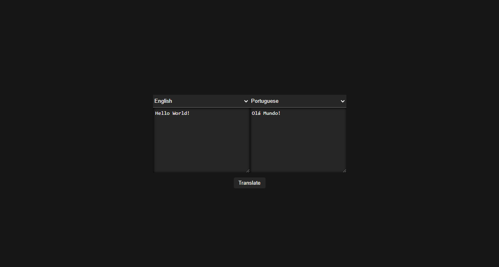

#  Translator
> A translator system made with Angular, Node.js and IBM Watson

 



### Installation
1. Front-End
```sh
$ git clone https://github.com/TacioAntonio/IBM-Watson-Translator
$ cd IBM-Watson-Translator/backend
$ npm i
$ npm start
```

2. Back-End
```sh
$ git clone https://github.com/TacioAntonio/Maven
$ cd IBM-Watson-Translator/frontend
$ npm i
$ npm start
```

## Contribution
Please read [CONTRIBUTING.md](https://github.com/TacioAntonio/IBM-Watson-Translator/blob/master/CONTRIBUTING.md) for details on our code of conduct, and the process for submitting pull requests to us.

## Versioning
We use [SemVer](http://semver.org/) for versioning. For the versions available, see the [tags on this repository](https://github.com/TacioAntonio/IBM-Watson-Translator/tags).

## Authors
| 
| -
| [Tácio Antônio](https://github.com/TacioAntonio/)

See also the list of [contributors](https://github.com/TacioAntonio/IBM-Watson-Translator/graphs/contributors) who participated in this project.

## License
This project is licensed under the MIT License - see the [LICENSE.md](https://github.com/TacioAntonio/IBM-Watson-Translator/blob/master/LICENSE.md) file for details.
